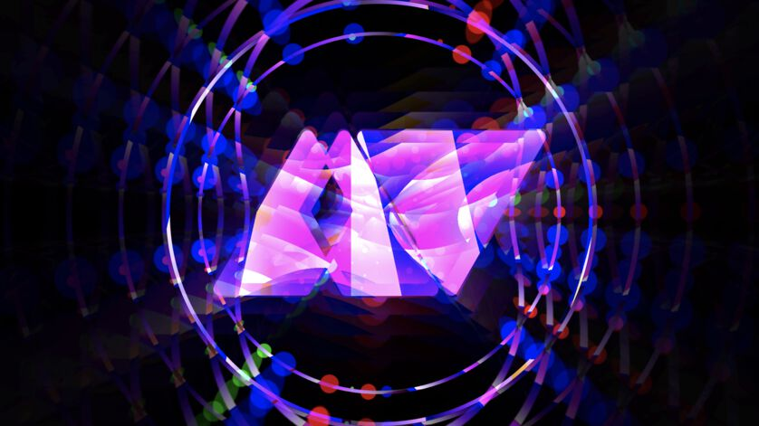
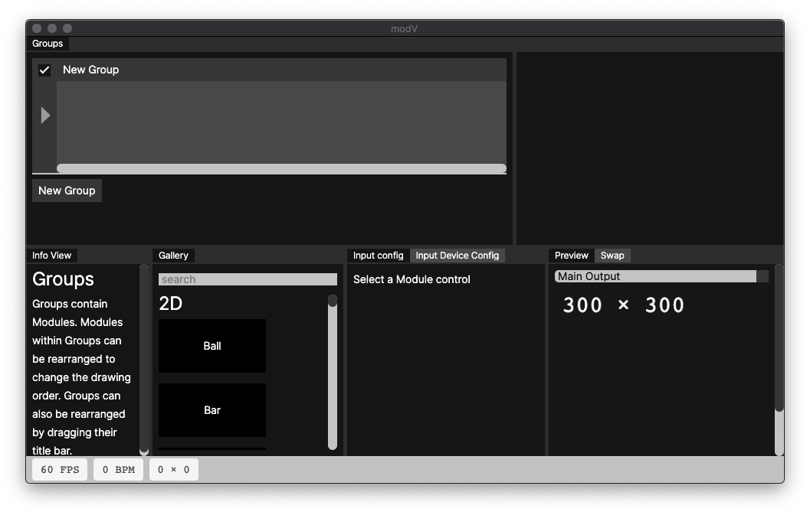
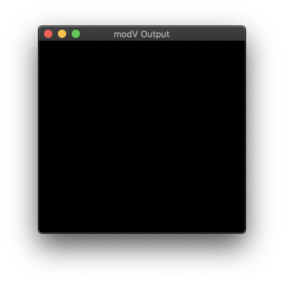
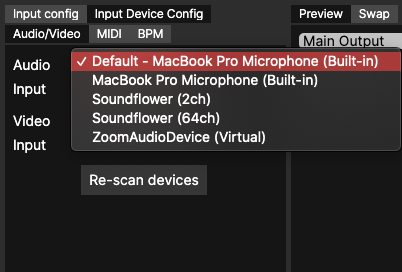

<h1>modV Workshop</h1>

> By using the open source software [modV](https://modv.vcync.gl/) you will be able to create audio reactive visualisations by combining different kinds of visual modules (2D, [Interactive Shader Format](https://isf.video/) and WebGL Shader) with any kind of audio input like a microphone or your favorite music. In the end you will know all the basics in order to do your first live performance as a VJ.

---

- [Prepare before the Workshop](#prepare-before-the-workshop)
  - [modV setup](#modv-setup)
  - [Audio Routing](#audio-routing)
  - [Download / clone the repository](#download--clone-the-repository)

---

## Prepare before the Workshop

If you have problems to prepare for the workshop, please make sure to reach out to us: [Tim Pietrusky](https://nerddis.co) or [Sam Wray](https://2xaa.fm)!

### modV setup

Install the [latest version of modV](https://github.com/vcync/modV/releases/latest). 

When you start modV, two windows should open: The **main window** and the **output window**. 

*modV main window*

*modV output window*

### Audio Routing

In order to get audio into modV to be able to visualize it, you need to [follow one of these guides for your operating system](https://modv.vcync.gl/v3/guide/#audio-routing). 

When everything works out, you can select your Audio Input under **Input Device Config**

*Audio Input Config*

If it doesn't work out, you can still use the microphone of your computer!

### Download / clone the repository

In order to get all files that are needed for the workshop, please [download](https://github.com/vcync/modV-Workshop/archive/main.zip) or clone the repository to your computer. 

The important folders are:

* [modules](/modules): Example modules to extend modV
* [presets](/presets): Configurations that will be used during the workshop

---

2020 by [Sam Wray](https://2xaa.fm) & [Tim Pietrusky](https://nerddis.co)