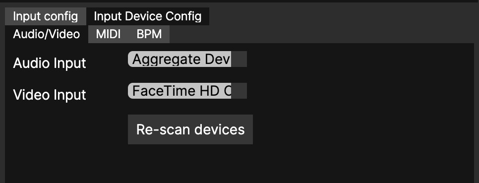
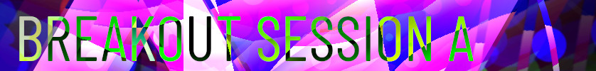
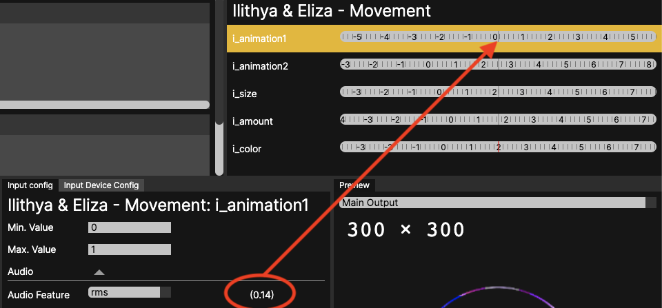
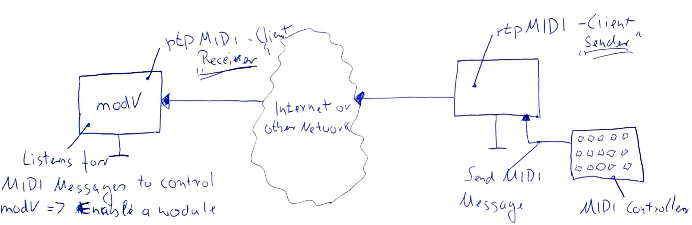

<h1>modV Workshop</h1>

> By using the open source software [modV](https://modv.vcync.gl/) you will be able to create audio reactive visualisations by combining different kinds of visual modules (2D, [Interactive Shader Format](https://isf.video/) and WebGL Shader) with any kind of audio input like a microphone or your favorite music. In the end you will know all the basics in order to do your first live performance as a VJ.

---

- [Prepare before the Workshop](#prepare-before-the-workshop)
  - [modV setup](#modv-setup)
  - [Audio Routing](#audio-routing)
  - [Download / clone the repository](#download--clone-the-repository)
- [1. History of modV](#1-history-of-modv)
  - [What does modV mean?](#what-does-modv-mean)
  - [Who is behind modV?](#who-is-behind-modv)
  - [Where is modV being used?](#where-is-modv-being-used)
- [2. How to use modV](#2-how-to-use-modv)
  - [User Interface](#user-interface)
    - [Input Device Config](#input-device-config)
    - [Output Window](#output-window)
  - [Menu](#menu)
  - [Rearrange the panel layout](#rearrange-the-panel-layout)
  - [Add a module to a group](#add-a-module-to-a-group)
    - [Text](#text)
  - [Change group preferences](#change-group-preferences)
  - [Use a filter: Pixelate](#use-a-filter-pixelate)
  - [Change module preferences](#change-module-preferences)
  - [Add another group and rename it](#add-another-group-and-rename-it)
  - [Save / Load a preset](#save--load-a-preset)
- [Breakout Session A](#breakout-session-a)
  - [Add images into modV](#add-images-into-modv)
  - [Add modules into modV](#add-modules-into-modv)
    - [Module licence](#module-licence)
    - [Add ISF shader into modV](#add-isf-shader-into-modv)
    - [Use blending to make logo visible](#use-blending-to-make-logo-visible)
    - [Create your own modules for modV](#create-your-own-modules-for-modv)
- [3. Use Audio in modV](#3-use-audio-in-modv)
  - [Audio processing in modV](#audio-processing-in-modv)
    - [Meyda](#meyda)
  - [Audio routing](#audio-routing-1)
  - [Audio reactive visuals](#audio-reactive-visuals)
    - [Assign an audio feature to a module property](#assign-an-audio-feature-to-a-module-property)
    - [Smoothing](#smoothing)
    - [Shape the property value with an Expression](#shape-the-property-value-with-an-expression)
- [Breakout Session B](#breakout-session-b)
- [4. Techniques to get certain effects](#4-techniques-to-get-certain-effects)
  - [Tunnel effect](#tunnel-effect)
      - [Module order](#module-order)
  - [Background fade](#background-fade)
      - [Module order](#module-order-1)
  - [Hue rotation for trailing colors](#hue-rotation-for-trailing-colors)
      - [Module order](#module-order-2)
  - [Text mask](#text-mask)
    - [Group 1](#group-1)
      - [Group settings](#group-settings)
      - [Module order](#module-order-3)
    - [Group 2](#group-2)
      - [Module order](#module-order-4)
  - [Liquid text](#liquid-text)
- [Breakout Session C](#breakout-session-c)
- [5. Use modV for a live performance](#5-use-modv-for-a-live-performance)
  - [Use a MIDI to control modV](#use-a-midi-to-control-modv)
  - [Remote control modV using RTP-MIDI](#remote-control-modv-using-rtp-midi)
    - [Prerequisites](#prerequisites)
    - [System requirements](#system-requirements)
    - [Guide for macOS and Windows](#guide-for-macos-and-windows)
    - [Debugging](#debugging)
- [6. Keep in touch](#6-keep-in-touch)
  - [Join the discussion on GitHub](#join-the-discussion-on-github)

---

# Prepare before the Workshop

If you have problems to prepare for the workshop, please make sure to reach out to us: [Tim Pietrusky](https://nerddis.co) or [Sam Wray](https://2xaa.fm)!

## modV setup

Install the [latest version of modV](https://github.com/vcync/modV/releases/latest). 

When you start modV, two windows should open: The **main window** and the **output window**. 

*modV main window*

*modV output window*

## Audio Routing

In order to get audio into modV to be able to visualize it, you need to [follow one of these guides for your operating system](https://modv.vcync.gl/v3/guide/#audio-routing). 

When everything works out, you can select your Audio Input under **Input Device Config**

*Audio Input Config*

If it doesn't work out, you can still use the microphone of your computer!

## Download / clone the repository

In order to get all files that are needed for the workshop, please [download](https://github.com/vcync/modV-Workshop/archive/main.zip) or clone the repository to your computer. 

The important folders are:

* [modules](/modules): Example modules to extend modV
* [presets](/presets): Configurations that will be used during the workshop

---

# 1. History of modV

In this workshop we are using modV 3.x, the latest version of modV that comes as a standalone desktop application. With modV, you can combine modules with each other to generate visual output. Every module has properties that can be updated in real time to change how the module is drawn. Each of these properties can also be updated automatically using audio features based on audio input (e.g. a microphone). 

## What does modV mean?

modV stands for "modular Visualization" and at it's core, it can be used to combine different kind of visual modules with each other to create a certain outcome. This is especially useful for live performances. 

## Who is behind modV?

* [Sam Wray](https://2xaa.fm), founder and core contributor
  * Created modV in 2014
* [Tim Pietrusky](https://nerddis.co), core contributor
  * Created NERDDISCO Studio in 2014 to generate visuals in the brower
  * Joined modV in 2016 when both Sam and Tim did a collab-talk + performance for dotJS 2016 in Paris

Since then we are using modV for shows around the world and also as part of [LiveJS](https://livejs.network). 

## Where is modV being used?

* [Various videos & images of modV in action](https://photos.google.com/share/AF1QipPhz8zKecemmMxnMbFdhFo-__tSmrmqMQzrD4YkE1MUFq-FQxqgePMFure5h05SfA?key=eDRWNVhnVjE4SXU5N0xSNVpBQkw0SmRxQ0JCZjFn)
* [Performance of 2xAA & NERDDISCO for GamerDisco 10th Anniversary](https://www.youtube.com/watch?v=2oPTMdeySAA&t=14)
* [Performance of 2xAA & NERDDISCO for OPEN UP SUMMIT 2020](https://www.youtube.com/watch?v=RhM3arvVAPM)
* [A talk about modV 2.x at dotJS 2016](https://www.youtube.com/watch?v=GA7-OfYSzvA)

---

# 2. How to use modV

Before we dive into creating audio reactive visuals, we want to explain how the UI of modV is structured so we can talk about the same things. 

## User Interface

* **A**: `Groups`. A Group contains modules. Modules within Groups can be arranged to change the drawing order. 
* **B**: `Module`. A module represents a visual element that draws something to the screen, like the `Text` module that can draw any kind of user generated text to the `Main Output`
* **C**: `Info View`. Shows information about the different panels in modV when you hover over them using your mouse. 
* **D**: `Gallery`. Contains all modules that can be added to a `Group`. Modules are categorized as `2D` (Canvas 2D), `ISF` (Interactive Shader Format) and `Shader` (WebGL Shader / GLSL). You can either scroll the list or use the search box at the top to find a specific module. 
* **E**: `Input config`.  The panel allows creation of Input Links. Select a `Module Control` in the `Module Inspector`, then use the `Input Config` to assign an `Audio Feature`, `MIDI control` or `Tween` to automate the Module Control.

* **F**: `Module Inspector`. When a `module` is focused, it shows all of it's properties. Each property can be updated to change how the module is drawn to the `Output Window`. 
* **G**: `Preview`. Shows the output of all enabled groups and modules. When you leave the default `Main Output`, it will show exaclty the same output as the `Output Window`.
* **H**: `Input Device Config`. Configuration for devices (Audio, Video, MIDI, BPM) that can be used as an input. 

### Input Device Config

* **Audio/Video**: 
  * Audio: Microphone or other audio source. Useful for audio routing.
  * Video: Webcam
* **MIDI**: Lists all MIDI controllers. 
* **BPM**: Lists all "Beats per Minute" sources

### Output Window

This window will be used to render the output of all enabled groups and modules. It can be used on a second screen or projector to show the generated visuals full screen. 

## Menu

There are multiple menu elements, but the most important ones are `File` and `View`:

* `File`
  * `Open Preset`: Load a preset from your computer into modV
  * `Save Preset`: Save a preset as JSON onto your computer that contains all groups, modules & settings of what you have created in modV
  * `Open Media Folder`; Uses your default application for exploring files (e.g. Finder on MacOS or Explorer on Windows) to open the `media` folder of modV. There you can put your images or third-party modules.
* `View`
  * `New Output Window`: Opens the output window if this was closed. 
  * `Reload`; As modV is a web application we can reload modV as we can reload any website in order to get a clean state.
  * `Reset Layout`: Makes sure that all panels are back in their original position after they were rearranged.  

## Rearrange the panel layout

Every panel in modV can be dragged and placed into different positions. This makes it possible to create any layout you want and feel comfortable with. 

* Move the `Info view` by clicking on it's title (keep the mouse button pressed) and dragging it onto the title of the `Gallery`. When you release the mouse button again, you can drop the `Info View` as a second tab besides the `Gallery`
* To give the `Gallery` even more space, we can click (keep the mouse button pressed) on the border between the `Gallery` and the `Input config`. Then we can move the mouse to the right to make the `Gallery` wider

## Add a module to a group

Now let's get some visual output. 

### Text

* Find the `Text` module in the `Gallery`, either by enterting the modules name into the search box or by scrolling trough the list of modules (hint: It's a `2D` module)
* Double click the module to add it to the active group (you might have to click on the group to focus it) or drag and drop it into the group
* Enable the module by clicking into the `Enable` checkbox, which will render the module into the `output`
* We still don't see anything, so let's go into the `Module Inspector` and change the property `text` by putting any text inside
* We still don't see very much, as a black text is rendered on a dark background, so let's change the `fillColor` to red
* To make the text bigger, we increase the `size`
* Now let's also enable `stroke` which gives us a white border around each character
* We also can change the `font`, where we can select any font that is installed on the computer
* Why do we see a morph effect and not just the 2D text? 

## Change group preferences

Each group determines how it's modules are drawn to the `Output window`. The default for this is `inherit`, which means that each frame is drawn on top of the frame before and the output is not cleared. Let's change this.

* Open the `group preference` by clicking on the arrow on the left side of the group, which will show you these options
  * **Enable**: Draws the group to the `Output window` if enabled
  * **Inherit**: If enabled, the Group will draw the output of the preceeding Group to the screen before drawing contained Modules. If there is only one Group enabled, the Group will draw the output of itself to the screen before drawing contained Modules
  * **Clearing**: If enabled, the Group will clear its Canvas before drawing contained Modules. If there is only one Group enabled and Inherit is on, clearing will have no affect.
  * **Pipeline**: If enabled, the Group will not draw each Module's output directly to the Group's Canvas. After each Module has drawn, the Group will cache the output, clear the Group Canvas and the next Module will recieve the cached result as its input. [Find more info & example](https://modv.vcync.gl/v3/guide/groups.html#pipeline)
  * **Alpha**: Sets the opacity of the group. 
  * **Blend**: Sets the Blend (e.g. Multiply) or Composition mode (e.g. Source in) of the group.
* We disable `Inherit` and enable `Clearing` and close the `group preference` by clicking on the arrow again
* Now our `Text` is rendered only once

## Use a filter: Pixelate

There are two kind of modules in modV. Some of them draw something "new", like the `Text` module did. Others changing the output based on what is actually drawn and do something with this. We call them `filter`, even when they are also "just" modules. 

* In the `Gallery` find the `Pixelate` 2D module
* Add it into the same group as the `Text`, but make sure to add it on the right side of `Text`

The order inside of a group matters, the modules are drawn on top of each other from left to right!

* We `Enable` the `Pixelate` module and see that the `Text` has a pixel-effect
* With focus on the `Pixelate` module we can now change the `Amount` in the `Module Inspector` to see the pixels getting bigger and smaller, depending in which direction the `Amount` is changed

## Change module preferences

Each module also has some default preferences which are visible all the time.

* Take a look the preferences:
  * **Enable**: If enabled, draws the module to the output.
  * **Alpha**: Sets the opacity of the module. 
  * **Blend**: Sets the Blend (e.g. Multiply) or Composition mode (e.g. Source in) of the module
* We set the `Blend` to `Multiply` and the `Alpha` to 0.5

## Add another group and rename it

We can also add more groups into modV.

* In `Groups`, click on the `New Group` button and see a new group under the first group
* Initially, the group is disabled, so let's enable it by clicking on the checkbox in the top left corner
* We also want to rename it, which can be done by double clicking on the group label `New Group` and entering a text
* Confirm this by pressing the Enter key

This makes it possible to group modules together that work well with each other. And during a live performance we can enable / disable a couple of modules at the same time. 

## Save / Load a preset

A preset contains all the groups and modules with all of their properties and can be used to switch between different configurations or exchange this with other people. In this workshop we use it to save the things we are doing or to load the predefined [presets](/presets) that come with the repository.

To make sure we don't loose what you already created, we first want to save our preset

* Im the menu choose `File` > `Save Preset`, which opens a dialog
* Enter a name for your preset and save it somewhere on your computer
* The file that was created is named `<name_of_preset>.json`

Now that we know how to save our configuration, we can load a preset

* Im the menu choose `File` > `Open Preset`, which opens a dialog
* There you can select the preset [001_modV_in_Action.json](presets/001_modV_in_Action.json) that comes with this repository
* After it is loaded, you will more or less see what we have created so far

---

🎇 [001_modV_in_Action.json](presets/001_modV_in_Action.json)

---

# Breakout Session A

* Play around with modV and get used to the UI
* Add modules from the `Gallery` and change their properties in the `Module Inspector` to see how they behave
* Change the `Blend` of the modules to make them interact with each other

---

## Add images into modV

Let's put an image (like a logo) into modV and apply some visual effects. 

* In the menu choose `View` > `Open Media Folder` which opens the media folder
  * If you want to know more about the strucutre of the media folder, please take a look at the [documentation](https://modv.vcync.gl/v3/guide/media.html#media-folder)
* Navigate into `default` > `image` and put any image (not SVG) into the folder
* In modV find the `Texture 2D` module in the `Gallery` and add it to the second group
* In the `Module Inspector` for the module select `image` in the `texture` property, which adds a new list underneath
* In the list, select the image you added into the `image` folder

Now that we have the image in modV, we can change some properties to make it fit the output window, depending on how small or big it is. 

---

## Add modules into modV

The biggest power over modV is that you can extend it with your own or other third-party modules as modV supports different kind of visual sources. So let's see how this can be done. 

### Module licence

Every time you take visual modules from other people, you have to be sure to check out the licence. Some work is only allowed for non-commercial projects (e.g [CC BY-NC-SA 3.0](https://creativecommons.org/licenses/by-nc-sa/3.0/deed.en_US)), others you can use for commersial purposes (e.g. [MIT](https://opensource.org/licenses/MIT)), but you have to make sure to credit the author. 

Let's take a look at platforms where you can find modules: 

Platform | Default License
--- | ---
[Shadertoy](https://www.shadertoy.com/) | [Attribution-NonCommercial-ShareAlike 3.0 Unported (CC BY-NC-SA 3.0)](https://creativecommons.org/licenses/by-nc-sa/3.0/deed.en_US)
[CodePen](https://codepen.io) | [MIT](https://opensource.org/licenses/MIT)
[ISF Editor](https://editor.isf.video/shaders) | Depends on each shader

So when you are taking something from someone: 

* Make sure to find the license
* Get in contact with the developer if you can't find a license or the license doesn't suit the purpose of your project
* Don't use someone's work if it's not covered by their license
* Credit the author for their work
* Thank the author!!!

### Add ISF shader into modV

For this workshop we are collaborating with [ilithya](https://twitter.com/ilithya_net) and [eliza](https://twitter.com/iamelizasj) which means we can use their awesome "[Movement](https://codepen.io/ilithya/pen/poyMNvG)" shader to show how audio reactivity works. As the file should only be used in this workshop, we will provide the URL to shader when the actual workshop happens. For everyone else doing this tutorial, you can pick one of the [modules](/modules) in the repository. 

* In the menu choose `View` > `Open Media Folder` which opens the media folder
* Navigate into `default` > `module` and put the `ilithya_eliza_movement.js` into it (or any other custom module)
  * Custom modules must follow the implemention guide lines of modV in order to work, see TODO add resources for Canvas2D + ISF

The original shader was published on CodePen and we used the ISF editor to parameterize it. All parameters that you add in ISF are also automatically available in modV via the `Property Inspector`. 

### Use blending to make logo visible

The last thing we want to do is to make the logo visible again. 

* Select the `Texture 2D` module and select `Source in` in the `Module preferences` as a `Blend`

---

🎇 [002_custom_image_and_custom_module.json](presets/002_custom_image_and_custom_module.json)

---

### Create your own modules for modV

Instead of using predefined modules, we can also integrate our own modules into modV by converting the original code into a format that is usable inside of modV. As this would go into too much detail, we are showing you some guides on how this can be achived:

* [2D module](https://modv.vcync.gl/v3/guide/writingA2dModule.html)
* [ISF module](https://modv.vcync.gl/v3/guide/writingAnIsfModule.html)
  * We recommend to use the ISF format and not putting your GLSL shader as a `WebGL shader` into modV as the debugging possibilities in modV are very limited. Using the [ISF editor](https://editor.isf.video/) as described in the guide is way more advanced, especially for debugging problems.

---
---
---

# 3. Use Audio in modV

## Audio processing in modV

### Meyda

modV uses [Meyda](https://meyda.js.org/) to analyze the incoming audio.

> _Meyda is a JavaScript audio feature extraction library. It works [...] to expose information about the timbre and perceived qualities of sound._

Meyda gives us specialised "features" of the audio which allows for some extremely punchy visualizations.

The key part to know about Meyda is that it gives us access to values that correlate to how our brains inteprate the audio and music.

Traditional audio-visual programs give allow access to the frequencies of audio (FFT values).

So with Meyda, rather than a value which says the frequencies in one specific range are loud or quiet at any one time, Meyda abstracts that information into more useful values which could tell us a part of the song is still loud, but it _sounds_ mellow, so our visuals will more-or-less follow how the song is being intepreted by the audience.

Let's take a look at a [demo of Audio Features vs FFT](https://di7h9.csb.app/).

---

🎇 [003_Audio_Features.json](presets/003_Audio_Features.json)

---

## Audio routing

1. Open the `Input Device Config` panel
2. In the sub-panel `Audio/Video`,  select the `Audio Input` drop-down menu
3. Find your audio source

> Note: at the time of the workshop you must have a working video input, or modV is unable to capture your selected audio source

## Audio reactive visuals

With Audio in modV we can create audio reactive visuals by assigning audio features to module properties. 

### Assign an audio feature to a module property

* Open 🎇 [002_custom_image_and_custom_module.json](presets/002_custom_image_and_custom_module.json)
* Select the module `Ilithya & Eliza - Movement` so that the `Module Inspector` is opened
* Click on the `i_animation1` property to select it
* In the `Input Config`, expend `Audio` and select `rms` as the `Audio Feature`

We can now "use" our audio source (e.g. talk into the microphone or play our music) and see that the value of the property is changing in the `Module Inspector`. What we can also see is the raw value of the `rms` `Audio Feature` right next to it in the `Input Config`

---

🎇 [003_Audio_Features.json](presets/003_Audio_Features.json)

---

### Smoothing

In order to get a smooth change when the `Audio Feature` is updated, we can also use `Smoothing`

* In the `Gallery` find the `scale` module and add it after the `Ilithya & Eliza - Movement` module
* Enable the module and set `Blend` to `Copy`
* In the `Module Inspector`, select the `scale` property
* In the `Input Config` > `Audio` select `energy`
  * As you can see, the value of `energy` is not between 0 and 1, but way above 1. It is there fore a good idea to restrict the maximum value when using `energy`
* Set the `Max. Value` to `0.02`
* Now let's make the value smooth by changing `Input Config` > `Smoothing` to `2,0`

---

🎇 [003_Audio_Features_Smoothing.json](presets/003_Audio_Features_Smoothing.json)

---

### Shape the property value with an Expression

In order to have more control on how an `Audio Feature` is changing the property of an module, we can use an `Expression`.

* Open 🎇 [003_Audio_Features_Smoothing.json](presets/003_Audio_Features_Smoothing.json)
* Select the `scale` module
* In the `Module Inspector`, select the `scale` property
* In the `Input Config` > `Expression` click into the textarea
* We see the content `value` which represents the value of the `Audio Feature`, in this case the value `scale` of the module `scale`
* We can do math operations in this textarea so let's try that, copy and paste the following expressions into the textarea and then click outside of the textarea to save the change
  * `value * 2`: makes the value bigger
  * `value / 2`: makes the value smaller
  * `value > 0.3 ? value : value / 2`: A condition that checks if the `value` is bigger than `0.3`. If it's bigger, then `value` will be used, if not then `value / 2` will be used

💡 If you want to see the actual value of a module property, you have to right click on the range slider. Another right click changes back to the range slider 

Make sure to checkout the [expressions documentation](https://modv.vcync.gl/v3/guide/expressions.html) for more insights. 

--- 

🎇 [003_Audio_Features_Expression.json](presets/003_Audio_Features_Expression.json)
🎇 [003_Audio_Features_Expression_Deluxe.json](presets/003_Audio_Features_Expression_Deluxe.json)

---
---
---

# Breakout Session B

* Play around with audio reactivity
* Use RMS / ZCR / Energy and find out how they are different from each other
* Use an expression to shape the value of an property
* Combine different audio features with each other

---
---
---

# 4. Techniques to get certain effects

>Note: Concentrics has been used an example module here. This can be substituted for any module drawing to the screen. Feel free to experiment!

## Tunnel effect

|Before|After|
|---|---|
|||

#### Module order

1. scale
    * Update prop `scale` to anything over or under 0
2. Concentrics

---

🎇 [004_Tunnel_effect.json](presets/004_Tunnel_effect.json)

---

## Background fade

|Before|After|
|---|---|
|||

#### Module order

1. block-color
    * Update prop `Alpha` to a low value over 0
2. Concentrics

---

🎇 [004_Background_fade.json](presets/004_Background_fade.json)

---

## Hue rotation for trailing colors

This builds upon the two previous techniques.

|Before|After|
|---|---|
|||

#### Module order

1. Hue-Saturation
    * Update prop `Hue` to anything just over or under 0
2. block-color
    * Update prop `Alpha` to a low value over 0
3. scale
    * Update prop `scale` to anything over or under 0
4. Concentrics

---

🎇 [004_Hue_rotation_for_trailing_colors.json](presets/004_Hue_rotation_for_trailing_colors.json)

---

## Text mask

This builds upon the three previous techniques.

|Before|After|
|---|---|
|||

### Group 1

#### Group settings
* Un-check `Inherit` in the group settings
    * This prevents the group from drawing the output of the previous (or last, if it's the first group) to the screen again

#### Module order
1. Hue-Saturation
    * Update prop `Hue` to anything just over or under 0
2. block-color
    * Update prop `Alpha` to a low value over 0
3. scale
    * Update prop `scale` to anything over or under 0
4. Concentrics

### Group 2

#### Module order
1. Text
    * Ensure the text fill color is `#000000` (black)
    * Set the blend mode of the Module to `Difference`

---

🎇 [004_Text_mask.json](presets/004_Text_mask.json)

---

## Liquid text

This preset makes heavy use of Blend modes and two very powerful ISF shaders, "Edge Distort" and "Optical Flow Distort".
Combined in the right way it's possible to achieve a "liquid" effect.

This is similar to the effect seen in a video clip of modV from JSConf EU 2018, though that was modV 2 so the composition was likely different.

---

🎇 [004_Liquid_Text.json](presets/004_Liquid_Text.json).

---

---

# Breakout Session C

* Play around with the advanced techniques, load each preset once and see how they behave

---
---
---

# 5. Use modV for a live performance

   * How to recover from a crash

---

## Using OBS to record locally and/or stream to Twitch

> OBS Studio is free and open source software for video recording and live streaming. Currently Linux, Mac and Windows Builds are available.

_[excerpt from obsproject.com](https://obsproject.com/wiki/)_

### Prerequisites

* An official OBS Studio build: https://github.com/obsproject/obs-studio/releases
* A secondary display, such as another monitor or projector

### Guide for all platforms

> You don't need to set up Twitch to record locally.

#### Set up your OBS scene

1. Open OBS Studio
2. Find the Sources panel and click the "+" icon
3. Add `Display Capture`
4. Select your secondary display in the display drop-down menu and click `OK`
    * If you cannot see your display on Windows, please follow the steps in the first post of this forum thread: [https://obsproject.com/forum/threads/solution-for-black-screen-display-capture-even-after-performing-the-steps-on-obs-forum.112109/](https://obsproject.com/forum/threads/solution-for-black-screen-display-capture-even-after-performing-the-steps-on-obs-forum.112109/)
5. If you see nothing, right-click `Display Capture` in the `Sources` panel, hover `Transform` and click `Fit to screen`

#### Configuring video settings
1. Open OBS' settings
2. Click `Output`
3. Set the `Base (Canvas) Resolution` to your secondary display's resolution
4. Set the `Output (Scaled) Resolution` to your stream's target resolution
    * If you want the highest quality, then set this to `1920x1080` as Twitch's max resolution is this
5. Set the `Common FPS Values` to your stream's target FPS
    * If you want the smoothest video, then set this to `60` as that is the maximum Twitch will display

#### Configuring streaming settings

1. Open OBS' settings
2. Click `Output`
3. In the `Streaming` section, check `Enable Advanced Encoder Settings` and uncheck `Enforce streaming service bitrate limits`
    * Twitch has a maximum video bitrate of 6000kbps. If your internet upload speed is good, try streaming at this maximum
    * Twitch has a maximum audio bitrate of 320kbps, despite what OBS tells you. This is why we uncheck the `Enforce streaming service bitrate limits`, otherwise our audio will sound bitcrushed
4. Encoder preset is up to you. We usually use `Quality`

#### Configuring recording settings

1. Open OBS' settings
2. Click `Output`
3. In the `Recording` section, ensure `Recording Format` is set to `mkv`
    * mkv files are recoverable if OBS crashes which is why we use the container format
4. `Recording Quality` will ideally be set to `Indistinguishable Quality, Large File Size`
    * this is to maximize the quality of the recorded modV session. Compression artefacts are more visible in the lower `Recording Quality` options
5. Encoder should ideally be set to `NVENC`, if you do not have this option try selecting anything which has a Hardware option
    * We suggest adapting this setting to your own computer's requirements. This article explains more on how to determin the encoder setting: [https://blog.streamlabs.com/how-to-optimize-your-settings-for-streamlabs-obs-f65d3cfdf196](https://blog.streamlabs.com/how-to-optimize-your-settings-for-streamlabs-obs-f65d3cfdf196)

#### Configuring Twitch

Follow this guide on how to connect OBS to Twitch: [https://www.tomsguide.com/uk/us/how-to-stream-to-twitch,news-21077.html](https://www.tomsguide.com/uk/us/how-to-stream-to-twitch,news-21077.html)

#### Recording / Streaming

In the main OBS window, click "Start Recording" to record locally.
If you want to stream, click "Start Streaming".

---

## Use a MIDI to control modV

It is really cool to the the UI of modV, but during a live gig we want to change between different modules fast. This is where MIDI comes into play, as we can use any MIDI controller that can be connected via USB to the computer in modV. 

* Connect the MIDI controller to the computer
* In the `Input Device Config` > `MIDI` make sure that your MIDI controller is shown
* Select the `Enable` checkbox of any module
* In the `Input Config` > `MIDI` click on `Learn`. This enables a mode where modV is listing for any MIDI input, for example the push of a button and then assigns this MIDI input to the module input that we selected before (in this case `Enable`)
* Push a button on your MIDI controller and see that `Learn` transformed into `Forget`

When we now press the same button again, we can toggle the `Enable` checkbox of the module which makes it possible to turn on and of the module using a MIDI controller.

💡 What is still missing is a way to also create a virtual MIDI controller so we can create the layout of the hardware MIDI controller and assign  labels to the different MIDI input elements (like a button or fader or knob) to see what they control in modV. We are working on this via: https://github.com/vcync/modV/issues/296

## Remote control modV using RTP-MIDI

> _RTP-MIDI (also known as AppleMIDI) is a protocol to transport MIDI messages within RTP (Real-time Protocol) packets over Ethernet and WiFi networks. It is completely open and free (no license is needed), and is compatible both with LAN and WAN application fields._

_[excerpt from RTP-MIDI on Wikipedia](https://en.wikipedia.org/wiki/RTP-MIDI)_

### Prerequisites

If you are attempting to network between two computers not on the same local area network (e.g. connected though the same router) and you and your partner cannot create a VPN between the two machines, you will both be required to open ports `5004` and `5005` on your router's firewall.

Please consult your router's documentation/your ISP/a search engine on how to do this as it can be different on each router.

Once your ports have been opened, you and you partner much each note down your public IP address'. On most home internet connections your public IP will not be static and could change at any time, so watch out for that.

### System requirements

* Windows
    * https://www.tobias-erichsen.de/software/rtpmidi.html
* Mac
    * It's built-in :D
        * `/Applications/Utilities/Audio MIDI Setup` > Window > Show MIDI Studio
        * There's a Network globe icon on the toolbar which opens the Network Configuration
* Linux
  * We've never tried this, but there is a package: [https://github.com/davidmoreno/rtpmidid](https://github.com/davidmoreno/rtpmidid)

### Guide for macOS and Windows
If you and your partner are on the same local network or are able to VPN between the two computers, Bonjour will auto-discover the partner machine in the Directory.

If you are not on the same network, please see the Prerequisites section above.  
Add the public IP of your partner to the directory. The port number will be `5004`.

Create and start a session.  
Add your partner from the directory to your session.

Once you're connected to each other you will see the latency update. (this sometimes is a little buggy on Windows).

Now you can route a MIDI device to the network port in the bottom right.

The top drop-down menu sends the MIDI device messages to the network session.
The bottom drop-down menu sends the incoming session messages to a device connected to your computer.

To use the incoming MIDI messages from the network session in an application (such as modV, Ableton, etc.), open the MIDI configuration and select the new virtual device which should share the session name.

### Debugging

We used [https://www.midimonitor.com/](https://www.midimonitor.com/) to check for incoming MIDI messages.

On Windows, right clicking rtpMIDI and running as Administrator _seemed_ to help, but this is not required according to [the rtpMIDI documentation](https://www.tobias-erichsen.de/software/rtpmidi/rtpmidi-tutorial.html).

---

# 6. Keep in touch

We are super happy that you are now a modV user and hope that you will have a lot of awesome experiences with it. Please make sure to always tag your work with **#modv** so we can keep in touch. 

## Join the discussion on GitHub

If you have a question or idea or just want to leave us a message related to modV, then please use [modV Discussions on GitHub](https://github.com/vcync/modV/discussions). 

---

2020 with ❤️ by [Sam Wray aka 2xAA aka NOSIGNAL](https://2xaa.fm) & [Tim Pietrusky aka NERDDISCO](https://nerddis.co)
